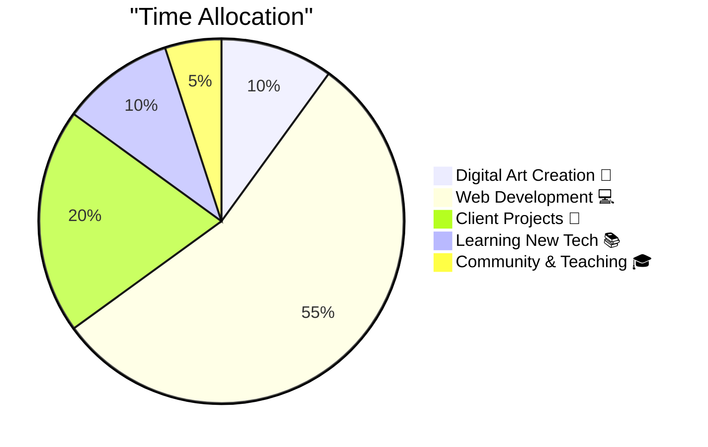

<div align="center">


</div>

<div align="center">

### 🎨 **Problem Solver • Full-Stack Developer • Creative Technologist**


---

[](https://www.ilhanart.org)
[](https://instagram.com/ilhanartgaleri)
[](mailto:galeri@ilhanart.org)


</div>

---
<div align="center">


</div>

---
## 🧭 **Protocol & Roadmap (Public)**

I'm building a new **protocol**: the constitution, governance, timeline, UI tools, and registry all live in a single repository.

- 🧩 **Root (Start Here):** https://github.com/galeri-coder/ilhanart-roadmap#readme
- 📜 **Protocols (Constitution):** https://github.com/galeri-coder/ilhanart-roadmap/tree/main/protocols
- 🗺️ **Roadmap (Stages & Timeline):** https://github.com/galeri-coder/ilhanart-roadmap/tree/main/roadmap
- 🗃️ **Registry (Proof & Notarization):** https://github.com/galeri-coder/ilhanart-roadmap/tree/main/registry
- 🧱 **UI Infrastructure:** https://github.com/galeri-coder/ilhanart-roadmap/tree/main/ui-infrastructure

<details>
  <summary><b>Repo Tree (click)</b></summary>

  ```text
  ilhanart-roadmap/
│
├─ README.md
│   → Root identity + summary of the protocol structure
│
├─ protocols/                         [CONSTITUTION: Rules & Governance]
│  ├─ README.md                       → Navigation for protocol documents
│  │
│  ├─ fpp-core/                       [CORE RULES: Hardest to change layer]
│  │  ├─ README.md
│  │  ├─ founding-patrons-protocol-EN.md
│  │  ├─ founding-patrons-protocol-TR.md
│  │  ├─ governance.md
│  │  └─ authority-appeals.md
│  │
│  ├─ fpp-extensions/                 [EXTENSIONS: Benefits / Utilities]
│  │  ├─ README.md
│  │  ├─ community-privileges.md
│  │  ├─ holder-tiers.md
│  │  ├─ nft-benefits.md
│  │  └─ token-utility.md
│  │
│  └─ ecosystem/                      [EXPANSION: Events / Venues / Infra]
│     ├─ README.md
│     ├─ Events.md
│     ├─ venue-partnerships.md
│     ├─ physical-infrastructure.md
│     └─ meme-coin-killer.md
│
│
├─ registry/                          [ARCHIVE: Proof & Notarization]
│  ├─ README.md
│  ├─ digitalnotary.md                → How the notary works + JSON schema
│  ├─ ILHAN-2025-REG-001.json         → Genesis verified entry
│  ├─ snapshots/                      → Historical JSON snapshots
│  ├─ merkle-roots/                   → Merkle proofs of registry states
│  └─ contribution-proofs/            → Evidence of individual entries
│
│
├─ ui-infrastructure/                 [INTERFACE: Browser-facing tools]
│  ├─ README.md
│  │
│  ├─ founding-patron-calculator-EN.html
│  ├─ founding-patron-calculator-TR.html
│  ├─ founding-patrons-premium.css
│  ├─ dom-optimization.js
│  ├─ nuclear-shield.css
│  │
│  ├─ exhibition-components/          → Shared UI building blocks
│  │
│  └─ site/
│     └─ v1.0/                        [Main public interface v1.0]
│        │
│        ├─ index.html                → Landing / Overview
│        ├─ poart.html                → Proof of Art (PoArt)
│        ├─ fpp.html                  → Founding Patrons Protocol
│        ├─ notary.html               → Digital Notary UI
│        ├─ public-registry.html      → Public Registry Viewer
│        ├─ consult.html              → Apply / Submit form
│        ├─ doc.html, docs.html       → Viewer for markdown docs
│        │
│        ├─ components/
│        │   ├─ nav.html              → Injected top navigation bar
│        │   └─ footer.html           → Injected footer
│        │
│        ├─ assets/
│        │   ├─ css/
│        │   │   └─ v1.css            → ✅ Final “F.P.P Glass” dark theme
│        │   │
│        │   └─ js/
│        │       └─ v1.js             → Dynamic loader for nav/footer + active link
│        │
│        └─ registry/                 → (optional local data mirror)
│
│
├─ roadmap/                           [TIME: Stages & Timeline]
│  ├─ README.md
│  ├─ Green-Blue-Stages.md
│  ├─ Purple-Stages-1.md
│  └─ Purple-Stages-2.md
│
│
└─ initiatives/                       [PROJECTS: Living Missions]
   └─ translation/
      └─ README.md                    → Translation mission docs

  ```
</details>


```javascript
const ilhanArt = {
  location: "Istanbul, Turkey 🇹🇷",
  role: "Founder & Lead Artist @ İlhan Art Studio",
  focus: ["Digital Art", "Web Development", "Creative Coding", "NFT"],
  passion: "Merging traditional art with cutting-edge technology",

  code() {
    while (caffeine > 0) {
      create();
      innovate();
      iterate();
    }
  },

  paint() {
    let canvas = new Canvas();
    canvas.applyColors(["#10b981", "#3b82f6", "#8b5cf6"]);
    canvas.addMagic(Infinity);
    return masterpiece;
  },

  currentProjects: [
    "🎨 Interactive Art Gallery Platform",
    "🖼️ NFT Collection Building",
    "🎓 Digital Art Workshops",
    "💻 Custom Web Solutions",
    "🌐 Web3 Art Marketplace"
  ],

  lifePhilosophy: "Create art that speaks, build code that inspires",
  coffeeConsumed: Infinity + "☕"
};

console.log("🎨 Creating magic...");
```

---

# 🏛️ İlhanArt [PoArt] & [F.P.P.] Unified Protocol Manifesto

This document formalizes the fundamental axioms of the İlhanArt ecosystem. It defines the transition from high-entropy speculative "Memecoin" chaos to a low-entropy "Civilizational" structure.

---

## I. Mathematical & Physical Foundations

The protocol is built on five core theoretical pillars to ensure systemic integrity:

### 1. The Logic of Integrity (Set Theory)
$$\text{Anti-Scam} \subset \text{Anti-Memecoin}$$
*Scams are defined as a subset of low-effort systems ($E_{\text{effort}} \to 0$). By rejecting the "low-effort" model, the protocol inherently excludes the scam subset.*

### 2. Ecosystem Thermodynamics (Entropy Reduction)
$$\Delta S_{\text{ecosystem}} = S_{\text{culture}} - W_{\text{human}}$$
*High-friction human work ($W_{\text{human}}$), such as complex book translations, acts as a cooling mechanism to reduce ecosystem entropy ($S$).*

### 3. Unified Patron Potential (Gravitational Field)
$$\Phi_{\text{Patron}} = \log_{10}(1 + \text{TWAB}) \times 10,000 \times \left( 1 + \frac{\sum P_{\text{cultural}}}{1000} \right)$$
*The logarithmic function ensures that capital (TWAB) has diminishing returns, preventing "whales" from holding absolute power.*

### 4. Maxwell’s Demon Filter (Information Theory)
$$H(\text{Claim}) = \begin{cases} 1, & \text{if } Q_{\text{score}} \geq 80\% \\ 0, & \text{if } Q_{\text{score}} < 80\% \end{cases}$$
*The Quiz-Gated Claim mechanism sorts high-quality signals from the noise of AI-generated or low-effort spam.*

### 5. Phase Transition (Theory → Practice, Live)
$$\mathcal{H}_{\text{Theory}} \xrightarrow[\text{VRF}]{\text{Solana/Rust}} \frac{dL}{dt}$$
*Static documentation ($\mathcal{H}$) represents potential energy; transition to "Live" execution via Solana results in time-dependent state changes.*

---

## II. The 15 Pillars of the Protocol: Problems and Solutions

The mathematical models above provide direct solutions to 15 chronic blockchain diseases:

1.  **Plutocracy Neutralization:** Logarithmic scoring prevents wealth from becoming absolute power.
2.  **Effort Staking:** Introduces "Proof of Contribution" as the primary status engine.
3.  **Intellectual Integrity (IPoW):** Quiz-gating blocks AI-spam and plagiarism.
4.  **Patience over Speed:** 365-day cycle ensures long-term civilizational alignment.
5.  **Zombie Filtering:** Annual Claim requirement ensures only active builders hold status.
6.  **Boutique Curation:** [PoArt] standard ensures only quality assets enter the exchange.
7.  **40% Integrity Veto:** Community power to freeze low-quality or fraudulent proposals.
8.  **The Legacy Key:** Soulbound status transfer for intergenerational continuity.
9.  **Anti-Exit Liquidity:** Millennium Vault locks tokens for 10 years to prove belief.
10. **Cybersecurity Bonus:** +100 points for hardware wallet migration.
11. **Flexible Justice:** Self-Migration allows secure wallet upgrades without status loss.
12. **Physical-Digital Bridge:** Seal of Kethüda turns digital data into family heirlooms.
13. **Dynamic Hierarchy:** Point Decay prevents permanent status oligarchy.
14. **Anti-Collusion Audit:** Meta-Reviews stop review rings from gaming the system.
15. **Psychological Resilience:** Grace Period protects Patrons from market-induced anxiety.

---

## III. Core Logic Engine (Implementation)

```javascript
/**
 * İlhanArt Unified Logic v1.2 (STABLE)
 * This code implements the [F.P.P.] Mathematical Foundation.
 */

const IlhanArtLogic = {
    /**
     * Implementing Equation III: Ranking and Plutocracy Neutralization
     * log10(1 + balance) * 10,000 * (1 + points / 1000)
     */
    calculatePatronPotential: (balance, points) => {
        const twab = Number(balance) || 0;
        const culturalPoints = Number(points) || 0;

        // Formula: log10(1 + TWAB) * 10,000
        const tokenScore = Math.log10(1 + twab) * 10000;

        // Formula: 1 + (Points / 1000)
        const multiplier = 1 + (culturalPoints / 1000);

        const result = tokenScore * multiplier;

        return {
            total: parseFloat(result.toFixed(2)),
            formatted: result.toLocaleString('en-US', { maximumFractionDigits: 2 }),
            status: culturalPoints >= 1000 ? "Legendary Patron" : "Standard Patron"
        };
    },

    /**
     * Implementing Equation IV: Maxwell's Demon Filter
     */
    verifyIPoW: (quizScore) => {
        return quizScore >= 0.80; // 80% passing grade
    }
};

// Simulation Test: 10,000 Tokens + 500 Cultural Points
console.log("Verified System Score:", IlhanArtLogic.calculatePatronPotential(10000, 500).formatted);


---

## 🛠️ **Tech Stack & Tools**

<div align="center">

### **Languages & Frameworks**


### **Design & Creative Tools**


### **Dev Tools & Platforms**


</div>

<div align="center">

```ascii
╔══════════════════════════════════════════════════════════╗
║  "Talk is cheap. Show me the code."  - Linus Torvalds   ║
╚══════════════════════════════════════════════════════════╝
```

</div>

---

## 📊 **GitHub Analytics**

<br>


<br>


<br>


---

## 💼 **What I'm Working On**

<div align="center">



</div>

**Currently Focused On:**
- 🎨 Building NFT art collection on Eth.
- 💻 Building interactive gallery platform with React
- 🎓 Creating comprehensive digital art course
- 🌐 Expanding global art community
- 🤖 Experimenting with AI-generated art

---

## 📈 **This Week I Spent My Time On**

<div align="center">

```text
🎨 Digital Art       ████████████████░░░░░░░░   65.0%
💻 Coding            ████████████░░░░░░░░░░░░   50.0%
📚 Learning          ████████░░░░░░░░░░░░░░░░   32.0%
🎓 Teaching          █████░░░░░░░░░░░░░░░░░░░   21.0%
☕ Coffee Breaks     ███████████████████████░   95.0%
```

</div>

---


---

## 🤝 **Let's Connect & Collaborate**

<div align="center">

I'm always open to:
- 🎨 **Art Collaborations** - Let's create something amazing together
- 💻 **Dev Projects** - Building innovative web solutions
- 🎓 **Mentoring** - Sharing knowledge and growing together
- 💬 **Just Chatting** - About art, tech, or life in general

### **Find Me On:**

[](https://www.ilhanart.org)
[](https://instagram.com/ilhanartgaleri)
[](https://www.youtube.com/İlhanARTLive)
[](https://twitter.com/Galerilhan)
[](https://www.facebook.com/alinaki.ilhan)
[](mailto:galeri@ilhanart.org)

</div>

---

## 😄 **Fun Facts**

<div align="center">

> 🎨 Paint dries faster than my CI/CD pipeline  
> 💻 "It works on my machine" - also applies to art  
> ☕ My coffee consumption violates the laws of thermodynamics  
> 🐛 More bugs in my code than colors on my palette  
> 🌙 3 AM: When bugs reveal themselves and ideas strike  
> 🎮 High score: 47 browser tabs open while coding

</div>

---

## 🎁 **Support My Work**

<div align="center">

If you appreciate what I create, consider supporting İlhan Art:

[](https://www.ilhanart.org/support)
[](https://www.ilhanart.org/alinakiilhan)
[](https://github.com/galeri-coder?tab=repositories)

**Support us through your skills or contributions!**  
Visit our [Support Page](https://www.ilhanart.org/support) to see how you can help, or explore our gallery to discover unique artworks.

</div>

---

<div align="center">

## 🌟 **Inspirational Tech Quotes**

```ascii
╔═══════════════════════════════════════════════════════════════╗
║                                                               ║
║  "First, solve the problem. Then, write the code."          ║
║  — John Johnson                                              ║
║                                                               ║
║  "Code is like humor. When you have to explain it,          ║
║   it's bad."                                                 ║
║  — Cory House                                                ║
║                                                               ║
║  "Experience is the name everyone gives to their mistakes."  ║
║  — Oscar Wilde                                               ║
║                                                               ║
╚═══════════════════════════════════════════════════════════════╝
```

</div>

---

<div align="center">

### 💚 **Thank You for Visiting!**


**Made with ❤️, 🎨, and countless ☕ by İlhan Art**

[](https://visitorbadge.io/status?path=galeri-coder)

 <em><b>Happy coding and creating!</b> 🚀</em> 

</div>
