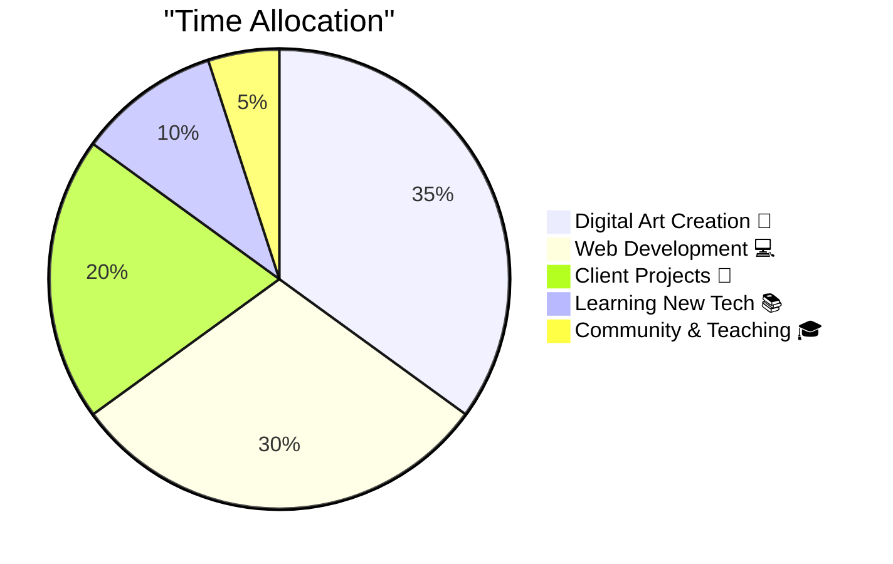

<div align="center">


</div>

<div align="center">

### 🎨 **Digital Artist • Full-Stack Developer • Creative Technologist**


---

[](https://www.ilhanart.org)
[](https://instagram.com/ilhanartgaleri)
[](mailto:galeri@ilhanart.org)


</div>

---

<div align="center">

## 💭 **Dev Wisdom of the Day**


</div>

---

## 🚀 **About Me**

```javascript
const ilhanArt = {
  location: "Istanbul, Turkey 🇹🇷",
  role: "Founder & Lead Artist @ İlhan Art Studio",
  focus: ["Digital Art", "Web Development", "Creative Coding", "NFT"],
  passion: "Merging traditional art with cutting-edge technology",
  
  code() {
    while (caffeine > 0) {
      create();
      innovate();
      iterate();
    }
  },
  
  paint() {
    let canvas = new Canvas();
    canvas.applyColors(["#10b981", "#3b82f6", "#8b5cf6"]);
    canvas.addMagic(Infinity);
    return masterpiece;
  },
  
  currentProjects: [
    "🎨 Interactive Art Gallery Platform",
    "🖼️ NFT Collection Launch",
    "🎓 Digital Art Workshops",
    "💻 Custom Web Solutions",
    "🌐 Web3 Art Marketplace"
  ],
  
  lifePhilosophy: "Create art that speaks, build code that inspires",
  coffeeConsumed: Infinity + "☕"
};

console.log("🎨 Creating magic...");
```

---

## 🎨 **What I Do**

<table>
<tr>
<td width="33%" align="center">


### 🖌️ **Digital Art**
Action painting meets technology. Creating dynamic, expressive artworks that push creative boundaries.

</td>
<td width="33%" align="center">


### 💻 **Web Development**
Building beautiful, responsive websites with modern tech stack. User experience is my art canvas.

</td>
<td width="33%" align="center">


### 🎓 **Teaching**
Sharing knowledge through workshops and mentoring. Empowering the next generation of digital artists.

</td>
</tr>
</table>

---

## 🛠️ **Tech Stack & Tools**

<div align="center">

### **Languages & Frameworks**


### **Design & Creative Tools**


### **Dev Tools & Platforms**


</div>

<div align="center">

```ascii
╔══════════════════════════════════════════════════════════╗
║  "Talk is cheap. Show me the code."  - Linus Torvalds   ║
╚══════════════════════════════════════════════════════════╝
```

</div>

---

## 📊 **GitHub Analytics**

<div align="center">

<a href="https://github.com/galeri-coder">
  
  
</a>

[](https://git.io/streak-stats)


</div>

---

## 💼 **What I'm Working On**

<div align="center">



</div>

**Currently Focused On:**
- 🎨 Launching NFT art collection on Ethereum
- 💻 Building interactive gallery platform with React
- 🎓 Creating comprehensive digital art course
- 🌐 Expanding global art community
- 🤖 Experimenting with AI-generated art

---

## 📈 **This Week I Spent My Time On**

<div align="center">

```text
🎨 Digital Art       ████████████████░░░░░░░░   65.0%
💻 Coding            ████████████░░░░░░░░░░░░   50.0%
📚 Learning          ████████░░░░░░░░░░░░░░░░   32.0%
🎓 Teaching          █████░░░░░░░░░░░░░░░░░░░   21.0%
☕ Coffee Breaks     ███████████████████████░   95.0%
```

</div>

---

## 🎨 **Latest Art Showcase**

<div align="center">

<table>
<tr>
<td width="33%">

<p align="center"><b>⚡ Action Painting Series</b></p>
<p align="center"><i>Dynamic movements captured in real-time</i></p>
</td>
<td width="33%">

<p align="center"><b>💧 Drip Art Collection</b></p>
<p align="center"><i>Fluid art meets digital innovation</i></p>
</td>
<td width="33%">

<p align="center"><b>🌌 Digital Abstracts</b></p>
<p align="center"><i>Where code becomes canvas</i></p>
</td>
</tr>
</table>

</div>

---

<div align="center">

## 💡 **Random Dev Quotes**


</div>

---

## 📝 **Latest Blog Posts**

<div align="center">

<!-- BLOG-POST-LIST:START -->
📌 [The Future of Digital Art in Web3](https://ilhanart.org/blog/web3-art)  
📌 [Building Interactive Art Galleries with React](https://ilhanart.org/blog/react-gallery)  
📌 [From Canvas to Code: My Journey](https://ilhanart.org/blog/my-journey)  
📌 [How AI is Transforming Creative Process](https://ilhanart.org/blog/ai-art)  
<!-- BLOG-POST-LIST:END -->

</div>

---

## 🤝 **Let's Connect & Collaborate**

<div align="center">

I'm always open to:
- 🎨 **Art Collaborations** - Let's create something amazing together
- 💻 **Dev Projects** - Building innovative web solutions
- 🎓 **Mentoring** - Sharing knowledge and growing together
- 💬 **Just Chatting** - About art, tech, or life in general

### **Find Me On:**

[](https://www.ilhanart.org)
[](https://instagram.com/ilhanartgaleri)
[](https://www.youtube.com/İlhanARTLive)
[](https://twitter.com/Galerilhan)
[](https://www.facebook.com/alinaki.ilhan)
[](mailto:galeri@ilhanart.org)

</div>

---

<div align="center">

## 🎯 **Trading Simulator**

### **⚠️ Yatırım Tavsiyesi Değildir ⚠️**

<details>
<summary><b>🚀 OPEN LONG POSITION (100x Leverage) 🚀</b></summary>

<br>

<div align="center">

### **Gerçekten açmak istiyor musun?** 🤔

<br>

<a href="https://elgoog.im/doabarrelroll/">

</a>

<br><br>

```
⚠️  WARNING: Side effects may include:
    - Barrel rolls 🎢
    - Dizziness 🤢  
    - Empty wallets 💸
    - Existential crisis 😵
```

<br>


### **💬 Öğüt:**

```
┌─────────────────────────────────────────┐
│                                         │
│   "Kusura bakma kardeşim,              │
│    bizde kaldıraca yer yok! 🚫         │
│                                         │
│    Çok döndü başımız... 🤯             │
│    O yüzden sanatla uğraşıyoruz! 🎨"   │
│                                         │
│                      - İlhan Art Studio │
│                                         │
└─────────────────────────────────────────┘
```

<br>

**🎨 Better investment: Create art, not losses! 💚**

</div>

</details>

</div>

---

## 😄 **Fun Facts**

<div align="center">

> 🎨 I can paint with both hands simultaneously while debugging code in my head!  
> 💻 My code is like my art - sometimes abstract, always intentional  
> ☕ Coffee consumption: **∞ cups/day** (scientifically proven)  
> 🌙 Best ideas come at 3 AM (along with the weirdest bugs)  
> 🎮 Can solve a Rubik's cube while explaining recursion

</div>

---

## 🎁 **Support My Work**

<div align="center">

If you appreciate what I create, consider supporting İlhan Art:

[](https://www.ilhanart.org/support)
[](https://www.ilhanart.org/alinakiilhan)
[](https://github.com/galeri-coder?tab=repositories)

**Support us through your skills or contributions!**  
Visit our [Support Page](https://www.ilhanart.org/support) to see how you can help, or explore our gallery to discover unique artworks.

</div>

---

<div align="center">

## 🌟 **Inspirational Tech Quotes**

```ascii
╔═══════════════════════════════════════════════════════════════╗
║                                                               ║
║  "First, solve the problem. Then, write the code."          ║
║  — John Johnson                                              ║
║                                                               ║
║  "Code is like humor. When you have to explain it,          ║
║   it's bad."                                                 ║
║  — Cory House                                                ║
║                                                               ║
║  "Experience is the name everyone gives to their mistakes."  ║
║  — Oscar Wilde                                               ║
║                                                               ║
╚═══════════════════════════════════════════════════════════════╝
```

</div>

---

<div align="center">

### 💚 **Thank You for Visiting!**


**Made with ❤️, 🎨, and countless ☕ by İlhan Art**

[](https://visitorbadge.io/status?path=galeri-coder)

 <em><b>Happy coding and creating!</b> 🚀</em> 

</div>
