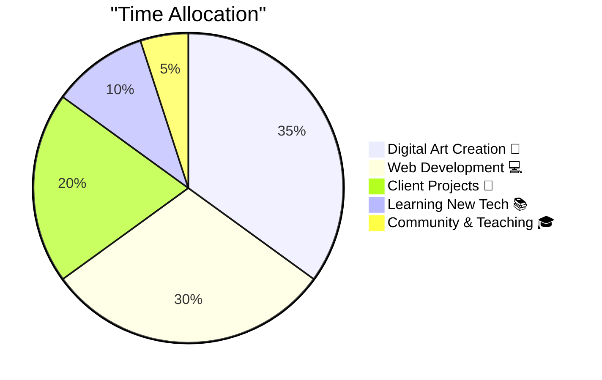

<div align="center">


</div>

<div align="center">

### 🎨 **Digital Artist • Full-Stack Developer • Creative Technologist**


---

[](https://www.ilhanart.org)
[](https://instagram.com/ilhanartgaleri)
[](mailto:galeri@ilhanart.org)


</div>

---

<div align="center">

## 💭 **Dev Wisdom of the Day**


</div>

---

## 🚀 **About Me**

```javascript
const ilhanArt = {
  location: "Istanbul, Turkey 🇹🇷",
  role: "Founder & Lead Artist @ İlhan Art Studio",
  focus: ["Digital Art", "Web Development", "Creative Coding", "NFT"],
  passion: "Merging traditional art with cutting-edge technology",
  
  code() {
    while (caffeine > 0) {
      create();
      innovate();
      iterate();
    }
  },
  
  paint() {
    let canvas = new Canvas();
    canvas.applyColors(["#10b981", "#3b82f6", "#8b5cf6"]);
    canvas.addMagic(Infinity);
    return masterpiece;
  },
  
  currentProjects: [
    "🎨 Interactive Art Gallery Platform",
    "🖼️ NFT Collection Launch",
    "🎓 Digital Art Workshops",
    "💻 Custom Web Solutions",
    "🌐 Web3 Art Marketplace"
  ],
  
  lifePhilosophy: "Create art that speaks, build code that inspires",
  coffeeConsumed: Infinity + "☕"
};

console.log("🎨 Creating magic...");
```

---

## 🎨 **What I Do**

<table>
<tr>
<td width="33%" align="center">


### 🖌️ **Digital Art**
Action painting meets technology. Creating dynamic, expressive artworks that push creative boundaries.

</td>
<td width="33%" align="center">


### 💻 **Web Development**
Building beautiful, responsive websites with modern tech stack. User experience is my art canvas.

</td>
<td width="33%" align="center">


### 🎓 **Teaching**
Sharing knowledge through workshops and mentoring. Empowering the next generation of digital artists.

</td>
</tr>
</table>

---

## 🛠️ **Tech Stack & Tools**

<div align="center">

### **Languages & Frameworks**


### **Design & Creative Tools**


### **Dev Tools & Platforms**


</div>

<div align="center">

```ascii
╔══════════════════════════════════════════════════════════╗
║  "Talk is cheap. Show me the code."  - Linus Torvalds   ║
╚══════════════════════════════════════════════════════════╝
```

</div>

---

## 📊 **GitHub Analytics**


<br>


<br>


<br>


</div>

---

## 💼 **What I'm Working On**

<div align="center">



</div>

**Currently Focused On:**
- 🎨 Launching NFT art collection on Ethereum
- 💻 Building interactive gallery platform with React
- 🎓 Creating comprehensive digital art course
- 🌐 Expanding global art community
- 🤖 Experimenting with AI-generated art

---

## 📈 **This Week I Spent My Time On**

<div align="center">

```text
🎨 Digital Art       ████████████████░░░░░░░░   65.0%
💻 Coding            ████████████░░░░░░░░░░░░   50.0%
📚 Learning          ████████░░░░░░░░░░░░░░░░   32.0%
🎓 Teaching          █████░░░░░░░░░░░░░░░░░░░   21.0%
☕ Coffee Breaks     ███████████████████████░   95.0%
```

</div>


## 🤝 **Let's Connect & Collaborate**

<div align="center">

I'm always open to:
- 🎨 **Art Collaborations** - Let's create something amazing together
- 💻 **Dev Projects** - Building innovative web solutions
- 🎓 **Mentoring** - Sharing knowledge and growing together
- 💬 **Just Chatting** - About art, tech, or life in general

### **Find Me On:**

[](https://www.ilhanart.org)
[](https://instagram.com/ilhanartgaleri)
[](https://www.youtube.com/İlhanARTLive)
[](https://twitter.com/Galerilhan)
[](https://www.facebook.com/alinaki.ilhan)
[](mailto:galeri@ilhanart.org)

</div>

---

<div align="center">

---

## 🚨 ** 100x LONG Demo - Educational Purpose Only** 🚨

> **⚠️ DISCLAIMER: This is a PARODY for educational purposes!**
> 
> This section intentionally mimics common scam tactics to demonstrate psychological manipulation.  
> **NO real investment, token sale, or financial offer.**  
> The button leads to a harmless demonstration (barrel roll animation).
> 
> **Purpose:** Learn to recognize red flags before encountering real scams.

---


<h1>
<a href="https://galeri-coder.github.io/barrel-roll" style="text-decoration: none;">
🚀 EXPERIENCE FOMO MANIPULATION (CLICK TO LEARN) 🚀
</a>
</h1>


### **📰 FAKE NEWS EXAMPLES (For Educational Purposes)** 📰

```
🔴 BLOOMBERG: "The Greatest Opportunity in History!" 💰
🔴 REUTERS: "Turned $100 into $1 Million!" 🚀
🔴 CNBC: "Wall Street Goes Crazy!" 📈
🔴 FINANCIAL TIMES: "New Bitcoin Discovered!" ⚡
🔴 FORBES: "Billionaires Are Investing in This!" 💎
🔴 WSJ: "FED Approved, SEC Authorized!" ✅
🔴 COINDESK: "Listed on 99 Exchanges Simultaneously!" 🏆
🔴 YAHOO FINANCE: "Elon Musk Just Tweeted!" 🐦
🔴 MARKETWATCH: "Fastest Rise in History!" 📊
🔴 BARRON'S: "Warren Buffett Made Investment!" 💰
🔴 ECONOMIST: "The Future of Economy!" 🌍
🔴 NIKKEI: "Asian Markets Stopped, Everyone Watching!" 🇯🇵
```

<br>

### **🎯 TYPICAL SCAM BUTTONS (Educational Examples)** 🎯

<a href="https://galeri-coder.github.io/barrel-roll">

</a>
&nbsp;&nbsp;
<a href="https://galeri-coder.github.io/barrel-roll">

</a>

<br>

<a href="https://galeri-coder.github.io/barrel-roll">

</a>
&nbsp;&nbsp;
<a href="https://galeri-coder.github.io/barrel-roll">

</a>

<br>

<a href="https://galeri-coder.github.io/barrel-roll">

</a>
&nbsp;&nbsp;
<a href="https://galeri-coder.github.io/barrel-roll">

</a>

---

</div>

---

## 🚨 **IMPORTANT LESSON** 🚨

<div align="center">

### **The more GIFs, ads, and promises you see, the farther you should run.** 🏃‍♂️💨

If something looks too good to be true, it probably is.  
Legitimate opportunities don't need flashy animations and "GUARANTEED RETURNS!" claims.

</div>

### **🔴 Red Flags to Watch Out For:**

**1. Self-Promotion & Hype** 🎪
- If a project constantly brags about itself, it's very likely a scam
- Real projects let their technology and adoption speak for themselves
- Excessive marketing = desperate for your money

**2. "Trusted" Team Background Means Nothing** 👥
- Even projects claiming connections to major exchanges (like B*nance) have scammed people
- Team reputation doesn't guarantee honesty
- Past success ≠ future integrity

**3. Large Communities Can Be Deceived** 🐑
- Millions of followers doesn't mean safety
- Remember: Ponzi schemes work until they don't
- Everyone can be wrong together

**4. "Slow Rugging" Tactics** 🐌💀
- Projects like LUNA gradually increased supply
- Small, incremental damage doesn't trigger immediate panic
- By the time you notice, it's too late
- Boiling frog syndrome: slow destruction is harder to detect

**5. Too Many Exchange Listings** 🏦
- Listing on 99 exchanges in one day? **RED FLAG**
- Real projects launch carefully and strategically
- Mass listings = pump and dump scheme

**6. Celebrity Endorsements Are Bought** 🌟
- Elon tweeted? Probably fake or paid
- Celebrities get paid to promote scams
- Do your own research (DYOR)

**7. Urgency & FOMO Tactics** ⏰
- "Only 3 spots left!" = psychological manipulation
- "Offer expires in 59 seconds!" = artificial pressure
- Real investments don't have countdown timers

---

### **✅ Real Wealth is Built Through:**

- 🎨 **Creating Value** - Build products, services, or art that people need
- 📚 **Continuous Learning** - Invest in your skills and knowledge
- 🤝 **Building Relationships** - Network with genuine people and communities
- ⏳ **Patience & Consistency** - Compound growth takes time, not hours
- 💡 **Critical Thinking** - Question everything, especially "guaranteed" returns

---

### **💡 Remember:**

> **If you clicked the button above, you just experienced FOMO (Fear Of Missing Out).**  
> Learn to recognize these manipulation tactics, and you'll save yourself from financial disasters.

**Stay curious. Stay skeptical. Stay safe.** 🛡️

---

---

## 😄 **Fun Facts**

<div align="center">

> 🎨 Paint dries faster than my CI/CD pipeline  
> 💻 "It works on my machine" - also applies to art  
> ☕ My coffee consumption violates the laws of thermodynamics  
> 🐛 More bugs in my code than colors on my palette  
> 🌙 3 AM: When bugs reveal themselves and ideas strike  
> 🎮 High score: 47 browser tabs open while coding

</div>

---

## 🎁 **Support My Work**

<div align="center">

If you appreciate what I create, consider supporting İlhan Art:

[](https://www.ilhanart.org/support)
[](https://www.ilhanart.org/alinakiilhan)
[](https://github.com/galeri-coder?tab=repositories)

**Support us through your skills or contributions!**  
Visit our [Support Page](https://www.ilhanart.org/support) to see how you can help, or explore our gallery to discover unique artworks.

</div>

---

<div align="center">

## 🌟 **Inspirational Tech Quotes**

```ascii
╔═══════════════════════════════════════════════════════════════╗
║                                                               ║
║  "First, solve the problem. Then, write the code."          ║
║  — John Johnson                                              ║
║                                                               ║
║  "Code is like humor. When you have to explain it,          ║
║   it's bad."                                                 ║
║  — Cory House                                                ║
║                                                               ║
║  "Experience is the name everyone gives to their mistakes."  ║
║  — Oscar Wilde                                               ║
║                                                               ║
╚═══════════════════════════════════════════════════════════════╝
```

</div>

---

<div align="center">

### 💚 **Thank You for Visiting!**


**Made with ❤️, 🎨, and countless ☕ by İlhan Art**

[](https://visitorbadge.io/status?path=galeri-coder)

 <em><b>Happy coding and creating!</b> 🚀</em> 

</div>
