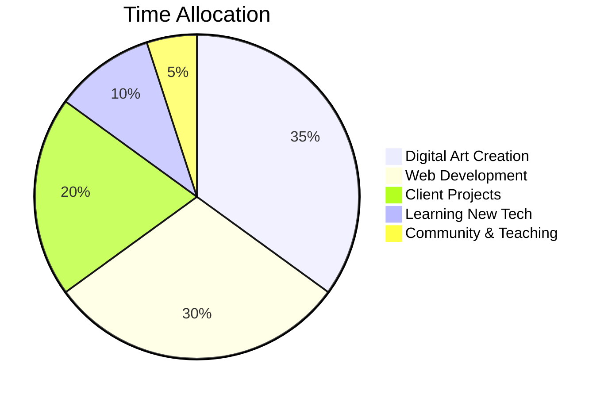

<div align="center">


</div>

<div align="center">

### 🎨 **Digital Artist • Full-Stack Developer • Creative Technologist**


---

[](https://ilhanart.org)
[](https://instagram.com/ilhanart)
[](mailto:galeri@ilhanart.org)


</div>

---

## 🚀 **About Me**

```javascript
const ilhanArt = {
  location: "Istanbul, Turkey 🇹🇷",
  role: "Founder & Lead Artist @ İlhan Art Studio",
  focus: ["Digital Art", "Web Development", "Creative Coding"],
  passion: "Merging traditional art with cutting-edge technology",
  
  dailyRoutine: () => {
    while (alive) {
      paint();
      code();
      innovate();
      inspire();
    }
  },
  
  currentProjects: [
    "🎨 Interactive Art Gallery Platform",
    "🖼️ NFT Collection Launch",
    "🎓 Digital Art Workshops",
    "💻 Custom Web Solutions"
  ],
  
  lifePhilosophy: "Create art that speaks, build code that inspires"
};
```

---

## 🎨 **What I Do**

<table>
<tr>
<td width="33%" align="center">

### 🖌️ **Digital Art**
Action painting meets technology. Creating dynamic, expressive artworks that push creative boundaries.

</td>
<td width="33%" align="center">

### 💻 **Web Development**
Building beautiful, responsive websites with modern tech stack. User experience is my art canvas.

</td>
<td width="33%" align="center">

### 🎓 **Teaching**
Sharing knowledge through workshops and mentoring. Empowering the next generation of digital artists.

</td>
</tr>
</table>

---

## 🛠️ **Tech Stack & Tools**

<div align="center">

### **Languages**


### **Frameworks & Libraries**


### **Design Tools**


### **Dev Tools**


</div>

---

## 📊 **GitHub Analytics**

<div align="center">

<a href="https://github.com/galeri-coder">
  
  
</a>

[](https://git.io/streak-stats)


</div>

---

## 🏆 **GitHub Trophies**

<div align="center">


</div>

---

## 🎯 **Featured Projects**

<div align="center">

<a href="https://github.com/galeri-coder/ilhanart-roadmap">
  
</a>

<a href="https://github.com/galeri-coder/ilhanart">
  
</a>

</div>

---

## 💼 **What I'm Working On**

<div align="center">



</div>

**Currently Focused On:**
- 🎨 Launching NFT art collection
- 💻 Building interactive gallery platform
- 🎓 Creating digital art course content
- 🌐 Expanding global art community

---

## 🌟 **Achievements & Milestones**

<div align="center">

| 🎨 Artworks | 👥 Clients | 🌍 Countries | ⭐ GitHub Stars |
|:-----------:|:----------:|:------------:|:---------------:|
| **500+** | **100+** | **25+** | **50+** |

</div>

---

## 📈 **This Week I Spent My Time On**

```text
🎨 Digital Art       ███████████░░░░░░   65%
💻 Coding            ████████░░░░░░░░░   50%
📚 Learning          █████░░░░░░░░░░░░   30%
🎓 Teaching          ███░░░░░░░░░░░░░░   20%
☕ Coffee Breaks     ███████████████░░   90%
```

---

## 🎨 **Latest Art Showcase**

<div align="center">

<table>
<tr>
<td width="33%">

<p align="center"><b>Action Painting Series</b></p>
</td>
<td width="33%">

<p align="center"><b>Drip Art Collection</b></p>
</td>
<td width="33%">

<p align="center"><b>Digital Abstracts</b></p>
</td>
</tr>
</table>

</div>

---

## 📝 **Latest Blog Posts**

<!-- BLOG-POST-LIST:START -->
- 🎨 The Future of Digital Art in Web3
- 💻 Building Interactive Art Galleries with React
- 🖌️ From Canvas to Code: My Journey
- 🚀 How AI is Transforming Creative Process
<!-- BLOG-POST-LIST:END -->

---

## 🤝 **Let's Connect & Collaborate**

<div align="center">

I'm always open to:
- 🎨 **Art Collaborations** - Let's create something amazing together
- 💻 **Dev Projects** - Building innovative web solutions
- 🎓 **Mentoring** - Sharing knowledge and growing together
- 💬 **Just Chatting** - About art, tech, or life in general

### **Find Me On:**

[](https://ilhanart.org)
[](https://instagram.com/ilhanart)
[](https://twitter.com/ilhanart)
[](https://linkedin.com/in/ilhanart)
[](https://discord.gg/ilhanart)

</div>

---

## 💭 **Random Dev Quote**

<div align="center">


</div>

---

## 😄 **Fun Fact**

<div align="center">

> I can paint with both hands simultaneously while debugging code in my head! 🎨💻  
> *Coffee consumption: ∞ cups/day* ☕

</div>

---

## 🎁 **Support My Work**

<div align="center">

If you appreciate what I create, consider:

[](https://buymeacoffee.com/ilhanart)
[](https://ilhanrt.org/commission)
[](https://github.com/galeri-coder?tab=repositories)

</div>

---

<div align="center">

### 💚 **Thank You for Visiting!**


**Made with ❤️, 🎨, and countless ☕ by İlhan Art**

[](https://visitorbadge.io/status?path=galeri-coder)

</div>
